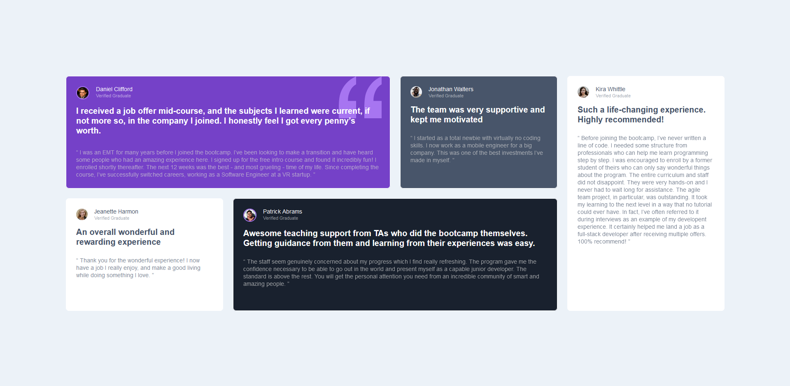

# Frontend Mentor - Testimonials grid section solution

This is a solution to the [Testimonials grid section challenge on Frontend Mentor](https://www.frontendmentor.io/challenges/testimonials-grid-section-Nnw6J7Un7). Frontend Mentor challenges help you improve your coding skills by building realistic projects.

## Table of contents

- [Overview](#overview)
  - [The challenge](#the-challenge)
  - [Screenshot](#screenshot)
  - [Links](#links)
- [My process](#my-process)
  - [Built with](#built-with)
- [Author](#author)

## Overview

### The challenge

Users should be able to:

- View the optimal layout for the site depending on their device's screen size

### Screenshot

### Links

- Solution URL: [GitHub Repo](https://github.com/ivanorsolic95/testimonial-grid-section)
- Live Site URL: [Check out my solution](https://testimonial-section-component.netlify.app/)

## My process

### Built with

- HTML5
- CSS custom properties
- Flexbox
- CSS Grid
- Mobile-first workflow

## Author

- Website - [Ivan Orsolic](https://ivanorsolic.live/)
- Frontend Mentor - [ivanorsolic95](https://www.frontendmentor.io/profile/ivanorsolic95)
- Twitter - [orsolic_ivan1](https://x.com/orsolic_ivan1)
